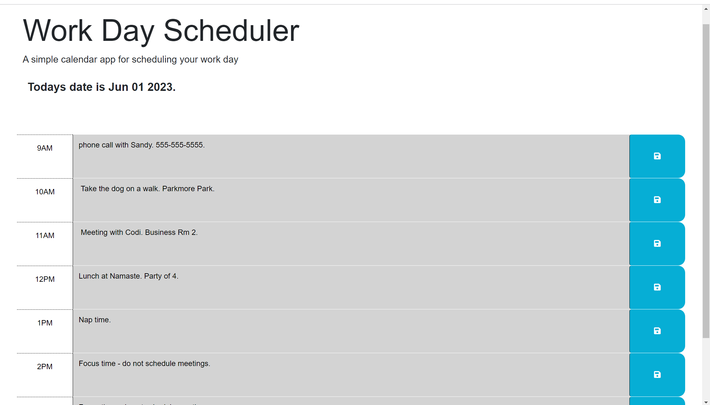

# module-5-challenge-daily-planner
Daily planner.

## Description 

This is a daily planner where the user can save their daily events.

Screenshots of live application:

Your site is live at https://jensandage1.github.io/module-5-challenge-daily-planner/

## Installation

N/A

## Usage

This webpage has a header of "work day scheduler" with a brief description underneath. Under that header it includes the current date which will update each day upon refreshing the page. The events will be saved when the user presses the save icon at the right of the description box line. This will save the data to local storage and then the data will be retreived and displayed on the page until the user changes or deletes the information and clicks save again. The hours are color coded depending on whether they are in the past, present, or future. 

## Credits

N/A

## License

Please refer to the LICENSE in the repo.

---

## Badges

## Features

## How to Contribute

## Tests
